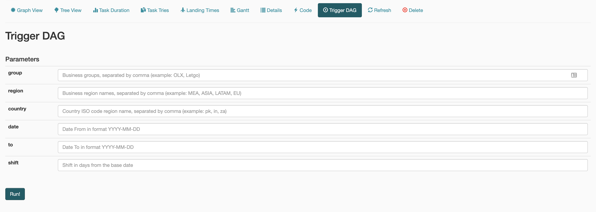

# UI Customization

Custom implementations of Airflow features (new ones or already existent). This features upgrade the Core packages and must to be installed after the Airflow installation. 

## Compatibility
All these features were tested in the following Airflow versions:
- 1.10.2 
- 1.10.3 

In case you need to install them in a different version, please contact mauro.rodriguez@olx.com and check the compatibility. 

## Installation
Replace the following files in the python site-packages folder (aka $SITE_PACKAGES) or create symbolic links to avoid moving files from this location to the site-packages location.

Source File (Repository)                        | Destination File (Python Site Packages)
----------------------------------------------- | -----------------------------------------
*odyn/ui/$AIRFLOW_VERSION/custom_trigger.html*  | *$SITE_PACKAGES/airflow/www/templates/airflow/custom_trigger.html*
*odyn/ui/$AIRFLOW_VERSION/dag.html*             | *$SITE_PACKAGES/airflow/www/templates/airflow/dag.html*
*odyn/ui/$AIRFLOW_VERSION/dags.html*            | *$SITE_PACKAGES/airflow/www/templates/airflow/dags.html*
*odyn/ui/$AIRFLOW_VERSION/views.py*             | *$SITE_PACKAGES/airflow/www/views.py*

## Features
### Trigger DAG
Upgraded **Trigger DAG** feature to be able to run DAGs with custom input parameters

#### Usage
In order to run a job with custom parameters you need to define in the DAG all the input fields you want to have available for filtering (as part of the default_args dictionary). Example:

###### DAG definition
```python
# input variables
input = {"group": "Business groups, separated by comma (example: OLX, Letgo)", 
         "region": "Business region names, separated by comma (example: MEA, ASIA, LATAM, EU)", 
         "country": "Country ISO code region name, separated by comma (example: pk, in, za)", 
         "date": "Date From in format YYYY-MM-DD", 
         "to": "Date To in format YYYY-MM-DD", 
         "shift": "Shift in days from the base date", }

default_args = {"owner": "ODYN-OPERATOR-PACK", 
                "depends_on_past": False, 
                "wait_for_downstream": True, 
                "input": input, 
                "provide_context": True, 
                "start_date": datetime.datetime(2019, 5, 29)}
                
dag = DAG(dag_id="dag_for_testing", 
          description="dag for testing with parameters", 
          default_args=default_args, 
          schedule_interval=None, 
          catchup=False)
```

###### Trigger DAG (Airflow UI)



